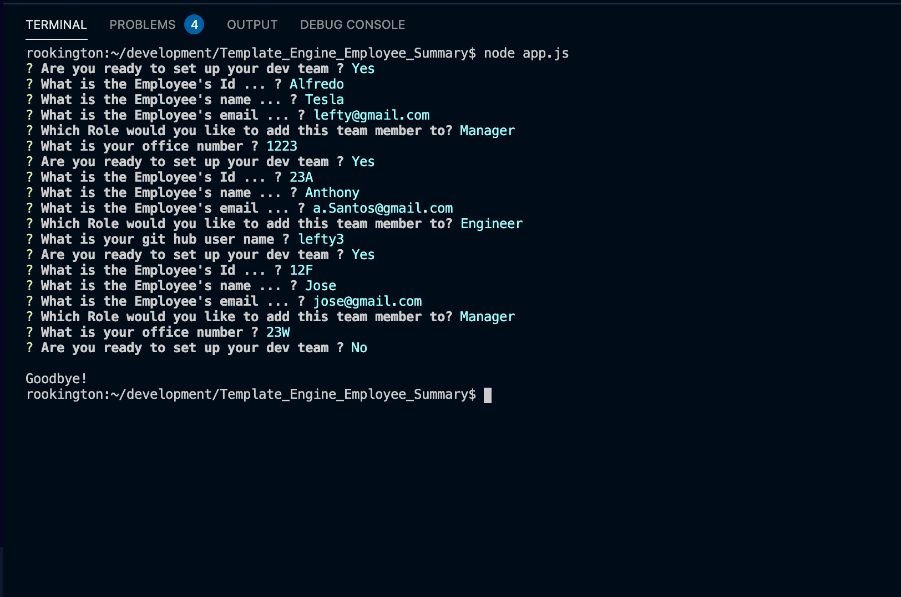

# TEMPLATE ENGINE EMPLOYEE SALARY

 

 
##  DESCRIPTION

 

A software engineering team generator command line application. 
The application will prompt the user for information about the team manager and then information about the team members. 
The user can input any number of team members, and they may be a mix of engineers and interns.

##  FUNCTIONALITY

The application will prompt the user for information about the team manager and then information about the team members. 
The user can input any number of team members, and they may be a mix of engineers and interns. 
This assignment must also pass all unit tests. When the user has completed building the team, 
the application will create an HTML file that displays a nicely formatted team roster based on the information provided by the user.

## TABLE OF CONTENTS
- [TEMPLATE ENGINE EMPLOYEE SALARY](#template-engine-employee-salary)
  - [DESCRIPTION](#description)
  - [FUNCTIONALITY](#functionality)
  - [TABLE OF CONTENTS](#table-of-contents)
  - [INSTALLATION](#installation)
  - [USAGE](#usage)
  - [LICENSE](#license)
  - [Contributing](#contributing)
  - [TEST](#test)
  - [QUESTIONS](#questions)

## INSTALLATION
 Clone Repo, Run Command `npm i`, Then `node app.js` to run program.

 ## USAGE
 This application will generate a team employee summary page. 
Run Command `npm start`, Follow the command line, Html  will be generated.

## LICENSE
 

 
This application is covered by the Open license. 
## Contributing
 Luis Feliz 
## TEST
 n/a
## QUESTIONS
 luisfeliz@gmail.com 

  
 GitHub:  

 
 Email me with any questions: luisfeliz@gmail.com  

 